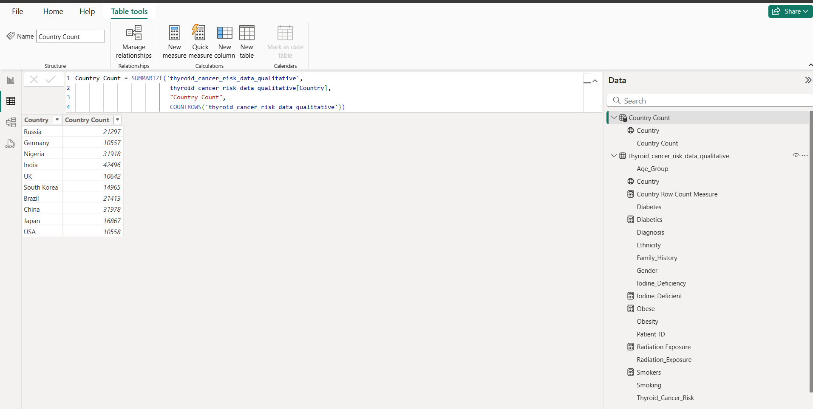
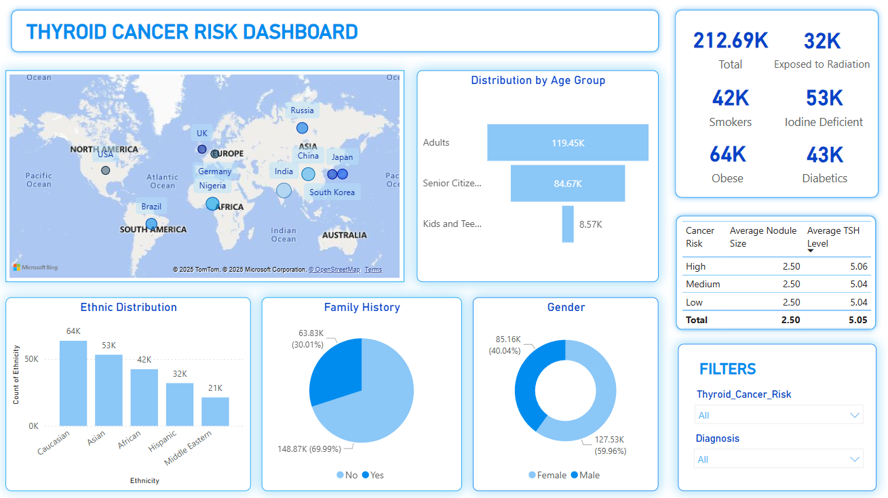

# Thyroid Cancer Risk Dashboard
Thyroid cancer is one of the most common types of endocrine cancer, affecting the thyroid gland located at the base of the neck. It is estimated that more than **2,00,000 cases** of thyroid cancer are diagnosed globally each year, and the number continues to rise. Fortunately, the survival rate for thyroid cancer is high, with a 5-year survival rate of over **98%** when detected early.

## Problem Statement
 * Identify and observe the factors responsible for Thyroid Cancer to gain insights and find patterns.
 * Find and compare the Thryroid Cancer contraction likelihood across various ethnic and geographic makeups.
 * Interpret and deliver insights that may help in early detection and potential prevention of the disease.

## Tools used
* MS Excel and Power Query for data cleaning and feature addition
* PowerBI Desktop for data visualization and data modeling

## Dataset
Data source : Kaggle

Link to raw dataset : [Thyroid Cancer Risk Dataset](https://www.kaggle.com/datasets/bhargavchirumamilla/thyroid-cancer-risk-dataset/data)

## Data Analysis and Visualizations

Performed the three-step process ETL by extracting the raw dataset from Kaggle website and loading it into Microsoft Excel for data validation and data cleaning. Transformed the data using Power Query into Qualitative and Quantitative tables for better segregation and ease of access, added features by manipulating existing data columns, and loaded the transformed data into Power BI Desktop for further analysis and visualization. Used DAX to create many explicit measures and tables to aid in Dashboard building and did basic modeling to create relationships between the tables.

### DATA MODEL:

Finally, used the dataset to create visualizations and KPIs, align and format the visualizations to create a Power BI Dashboard.

## Insights from the analysis:
* The data appears to support the frequent prevalence of the disease in males and females. The ratio of malignant diagonses in males to females is nearly 3:2.
* People with family history of the Thyroid Cancer are more at risk of contracting the disease than those without any family. The data supports the interplay of genetic factors in contraction of Thyroid Cancer.
* People with pre-existing health conditions like Diabetes and Obesity have a higher risk of Thyroid Cancer.
* The data supports the positive correlation between smoking and risk of malignant Thyroid Cancer.
* People who are Iodine Deficient, along with those are exposed more to radiation have significantly higher chances of developing Thyroid Cancer than others.
* The disease has a higher prevalence among people living in developing Asian and African countries that the developed ones.
